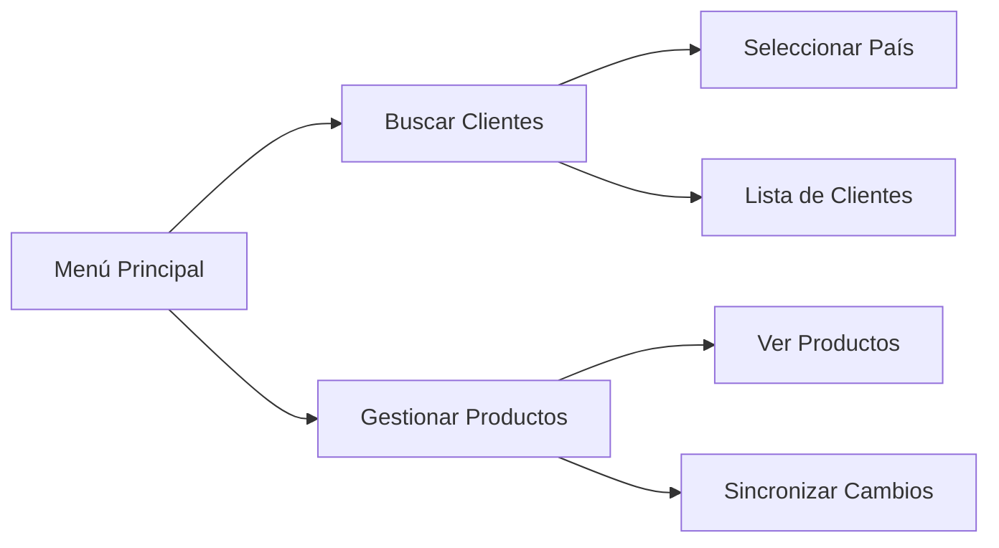

# 🖥️ Northwind WPF Applications

> Sistema de gestión de datos para la base de datos Northwind desarrollado en C# con WPF

## ✨ Características

### 📋 Gestión de Clientes
- 🔍 Búsqueda de clientes por país
- 📊 Visualización en lista interactiva
- ⚡ Carga dinámica de datos

### 🏷️ Gestión de Productos  
- 📦 Listado completo de productos
- ✏️ Edición en tiempo real
- 💾 Sincronización con base de datos

### 🔐 Seguridad
- 🔑 Autenticación integrada de Windows
- 🛡️ Conexiones seguras a SQL Server

---

## 🛠️ Tecnologías

| Tecnología | Versión |
|------------|---------|
| C# | .NET 6/7/8 |
| WPF | .NET Core |
| SQL Server | 2019/2022 |
| XAML | - |
| ADO.NET | - |

---

## 📁 Estructura del Proyecto

```
Northwind/
├── 📄 frmBuscarClientes.xaml
├── 📄 frmBuscarClientes.xaml.cs
├── 📄 Productos.xaml
├── 📄 Productos.xaml.cs
├── 📄 MainWindow.xaml
├── 📄 MainWindow.xaml.cs
└── 📄 Cliente.cs
```

---

## 🗃️ Base de Datos

### Diagrama de Base de Datos - Northwind

```
┌─────────────────────┐     ┌─────────────────────┐
│     Customers       │     │     Products        │
├─────────────────────┤     ├─────────────────────┤
│ CustomerID (PK)     │     │ ProductID (PK)      │
│ CompanyName         │     │ ProductName         │
│ ContactName         │     │ UnitPrice          │
│ Country             │     │ UnitsInStock       │
└─────────────────────┘     │ Discontinued       │
                            └─────────────────────┘
```

### Configuración de Conexión

```csharp
string cadenaConexion = "Server=.\\SQLEXPRESS;Database=Northwind;Integrated Security=True;TrustServerCertificate=True;";
```

---

## 🚀 Instalación

### Requisitos Previos

- ✅ Visual Studio 2022
- ✅ SQL Server o SQL Server Express
- ✅ Base de datos Northwind

### Pasos de Instalación

1. **Clonar el repositorio**
```bash
git clone https://github.com/yguevarao241/northwind-wpf.git
```

2. **Abrir el proyecto en Visual Studio**
```bash
cd northwind-wpf
start Northwind.sln
```

3. **Restaurar paquetes NuGet**
```bash
dotnet restore
```

4. **Configurar base de datos**
```sql
CREATE DATABASE Northwind;
-- Ejecutar script de Northwind
```

5. **Ejecutar aplicación**
```bash
dotnet run
```

---

## 💡 Funcionalidades

### 🏠 Menú Principal



### 🔍 Buscar Clientes
- Selecciona un país del ComboBox
- Visualiza los clientes en tiempo real
- Información detallada de cada cliente

### 🏷️ Gestionar Productos
- Visualización en DataGrid
- Edición de campos directamente
- Sincronización de cambios

---

## 📸 Screenshots

<p align="center">
  
  
</p>

---

## 🤝 Cómo Contribuir

1. **Fork** el proyecto
2. **Crea tu rama** (`git checkout -b feature/AmazingFeature`)
3. **Commit** tus cambios (`git commit -m 'Add: AmazingFeature'`)
4. **Push** a la rama (`git push origin feature/AmazingFeature`)
5. **Abre un Pull Request**

---

## 📝 Licencia

Distribuido bajo licencia MIT. Ver `LICENSE` para más información.

---

## 👩‍💻 Sobre la Autora

**Yesica Yanira**  
Estudiante de Ingeniería de Sistemas  
Sobreviviendo a base de café ☕ y código ⌨️  

📍 Perú  
📧 yesica.yanira@email.com  
🐙 [GitHub](https://github.com/yguevarao241)  

---

## 🌟 Agradecimientos

- 🙏 Microsoft por la base de datos Northwind
- 🙏 Comunidad de desarrollo de C# y WPF
- 🙏 Mi café de cada mañana ☕

---

<p align="center">
  <b>⭐ Si te gusta el proyecto, ¡no olvides darle una estrella! ⭐</b>
</p>

---

*"Cada línea de código es un paso hacia algo más grande."*
